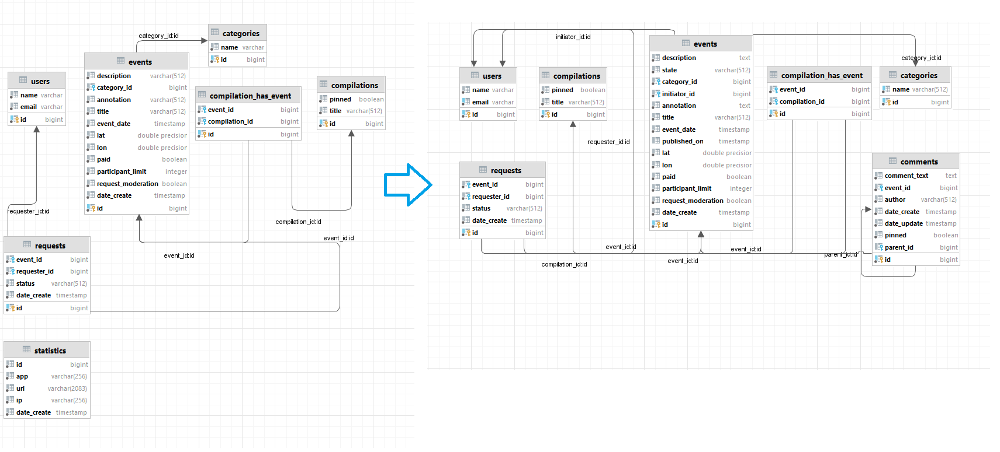

# java-explore-with-me

# Добавление комментариев

Комментарии могут быть добавлены с публичного api неавторизованным пользователем,
достаточно указать имя при отправке комментария к событию. 
Комментарии могут быть вложенными

Авторы событий могут удалять комментарии, а также закреплять и откреплять их.
В эндпоинтах событий возвращается список комментариев корневого уровня.
При запросе комментария по идентификатору подгружается дерево вложенных комментариев.

# Изменения в Схеме

